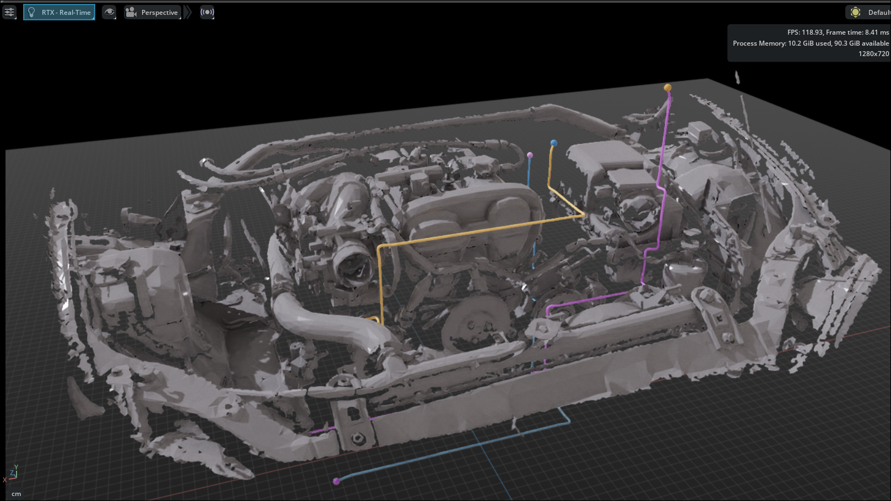

# Accelerated 3D Routing

GPU-accelerated, constraint-aware **3D routing of cables and pipes** through automotive
USD scenes, inside NVIDIA Omniverse. An Omniverse Kit extension (window name:
**PipeRouter**) voxelizes the scene with **NVIDIA Warp** and hands the grids to a
containerized solver that finds the routes with **NVIDIA cuGraph** shortest paths on the
GPU - electric wires, CAN buses, AC lines and cooling circuits alike.



## Architecture

| Piece | Where | What |
|---|---|---|
| `services/solver/piperouter_solver` | pure Python (GPU-optional) | grids → direction-aware weighted lattice (default: adaptive `octree_lattice`) → SSSP → fibre-neutre smoothing; all constraint math |
| `services/solver/piperouter_service` | **Docker, cuGraph/GPU** | FastAPI `/solve` `/solve_all`; grids handed over via `/dev/shm/piperouter` |
| `exts/omni.piperouter` | **Omniverse Kit** | omni.ui panel, Warp voxelization + thermal/EM fields, USD tube authoring, the expert workflow |

**Stack:** NVIDIA Warp (GPU voxelization, in-process in Kit) · NVIDIA cuGraph (GPU
single-source shortest paths in the solver container, with a scipy Dijkstra CPU
fallback so everything also runs GPU-less) · numpy/scipy solver core · FastAPI ·
OpenUSD + omni.ui.

Constraints: **hard** = collision + safety clearance (global default or per-object
clearance tags), thermal melt cutoff, waypoints, pinned start/end headings (axis presets
or a rotatable arrow gizmo); **soft** (weighted edge cost) = surface-hug, thermal, EM
(× wire sensitivity), bend/turn penalty, smoothing strength. Wire types
(cost/mass/diameter/bend/temp) live in `wire_types.json`.

## Quick start

```bash
# 1. Start the GPU solver (workstation with an NVIDIA GPU + Container Toolkit)
docker compose up --build -d
curl http://localhost:8000/health        # {"status":"ok","backend":"gpu"}

# 2. Enable the extension in USD Composer / Isaac Sim:
#    Window > Extensions > add this repo's exts/ to the search paths > enable omni.piperouter
```

See `exts/omni.piperouter/docs/README.md` for the full workflow (Route All → refine one
wire with waypoints → lock → BOM export) and `docker-compose.yml` for the service.

## Development

```bash
python3 -m venv .venv && .venv/bin/pip install -e services/solver
.venv/bin/pip install numpy scipy pytest fastapi "uvicorn[standard]" httpx usd-core warp-lang

# solver core + service
cd services/solver && ../../.venv/bin/pytest -p no:pqm -q          # 103 tests
# extension headless logic (Warp voxelize, USD authoring, real-HTTP solve)
cd exts/omni.piperouter && ../../.venv/bin/pytest -p no:pqm -q     # 88 tests
```

GPU paths (cuGraph in the container, Warp in the extension) run on the hardware; the
solver core falls back to scipy Dijkstra so tests pass without a GPU.

## Status

Built and tested: solver core, GPU service, Kit extension with the full expert workflow -
Route All / per-wire refine with waypoints (double-click to drop one on a tube), bundles
with shared trunks, start/end heading gizmo, thermal/EM/clearance tagging (incl.
instanced CAD), buried-endpoint rescue, occupancy/thermal/EM overlays and per-wire debug
views, session save/load to a single USD, BOM export. Default planner is the adaptive
`octree_lattice` (~10× faster than the dense lattice at high resolutions).

Roadmap candidates: design-space keep-in zones, drag-to-edit local re-solve, raceway
corridors, bundle-diameter formula, pressure-drop checks for cooling circuits.
