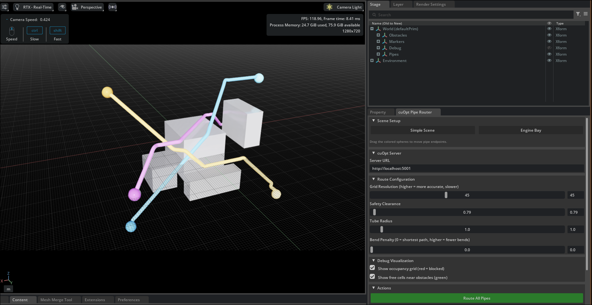
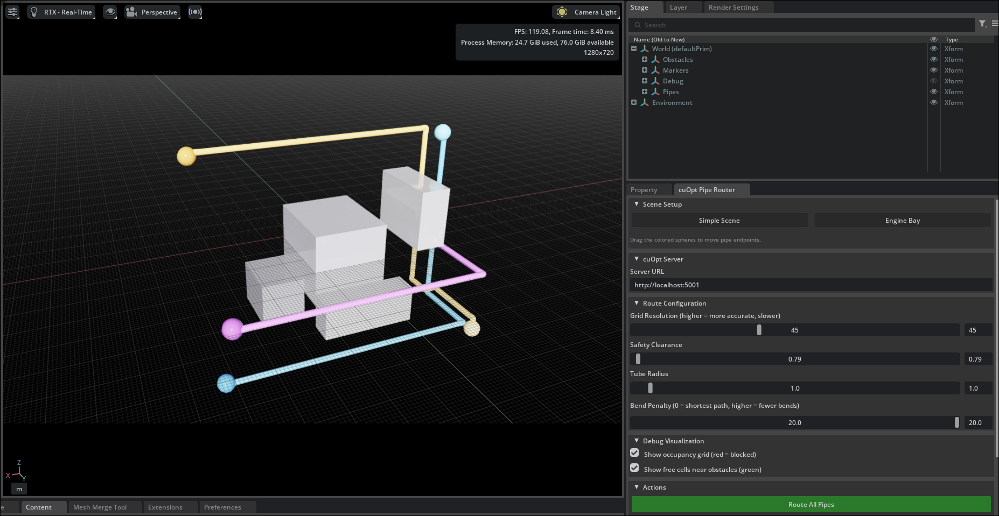
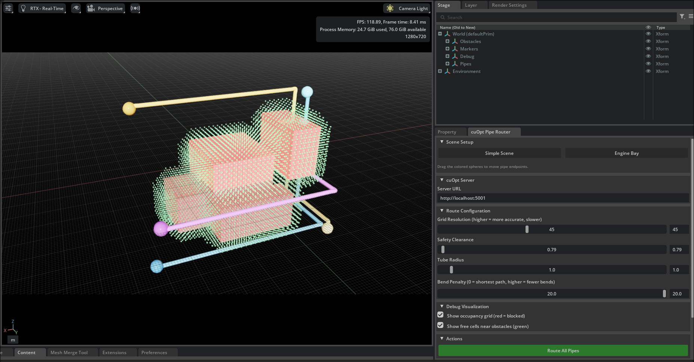
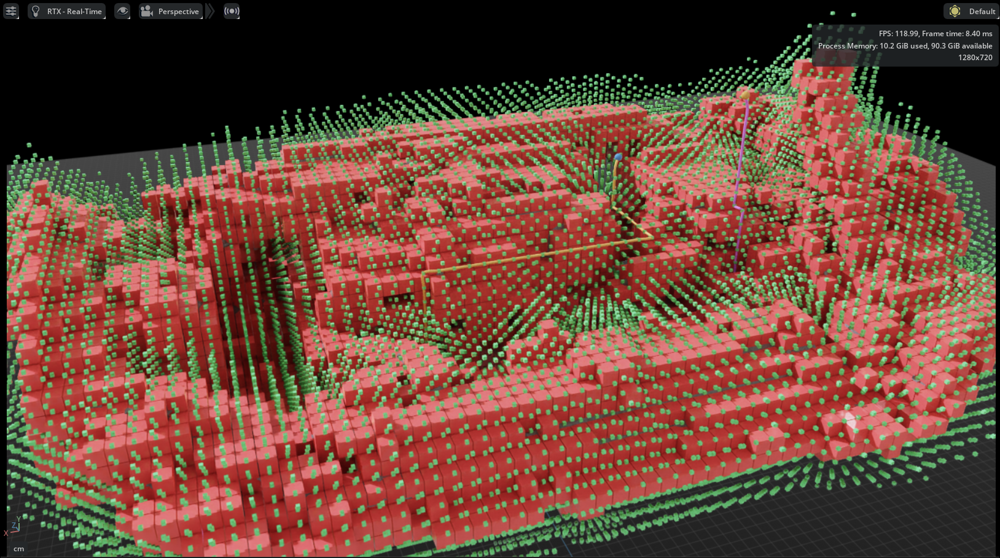

# cuOpt Pipe Router

An NVIDIA Omniverse extension that routes pipes through 3D environments while avoiding obstacles. Uses **NVIDIA Warp** for GPU mesh voxelization and **NVIDIA cuOpt** for GPU-accelerated route optimization.


## Quick start

### 1. Start the cuOpt server

```bash
docker run --gpus all -it --rm -p 5001:5000 nvidia/cuopt:26.4.0-cuda13.0-py3.13
```

### 2. Install the extension in Omniverse

1. Open USD Composer (or Isaac Sim)
2. Go to **Window > Extensions > gear icon**
3. Add this repo's path as a search path
4. Search for **cuOpt Pipe Router** and enable it

### 3. Create a scene and route

1. Click **Simple Scene** or **Engine Bay** to load a preset
2. Drag the colored spheres to position pipe start/end points
3. Adjust resolution, clearance, and bend penalty
4. Click **Route All Pipes**

## Scenes

### Simple scene

Five cube obstacles with three pipe routes. Good for understanding the system.

| Bend penalty = 0 (shortest path) | Bend penalty = 20 (fewer bends) |
|---|---|
|  |  |

### Engine bay

Loads a 3D scanned engine bay from `assets/engine_bay.usdc` with three pipe routes (coolant, oil line, AC line). Works with any imported mesh, just drop it under `/World/Obstacles`.


## How it works

```
Scene geometry (any mesh under /World/Obstacles)
        |
        |  Warp GPU kernel: signed distance query per grid cell
        |  Inside mesh or within clearance = blocked
        v
Occupancy grid (3D voxel grid, red = blocked, green = free)
        |
        |  Build CSR waypoint graph from free cells
        |  26-connected neighbors, edge weight = distance + bend penalty
        v
CSR graph --> JSON --> POST to cuOpt server
        |
        |  cuOpt solves optimal route on GPU
        |  Returns waypoint-level path
        v
Smooth with Catmull-Rom spline, generate tube mesh
```

Pipes are routed sequentially. Each completed pipe becomes an obstacle for the next one.

## Debug visualization

Enable the checkboxes under **Debug Visualization** to see what the solver sees:



- **Red cubes** = blocked cells (obstacle geometry + safety clearance)
- **Green dots** = free cells near obstacles (the nodes cuOpt can route through)



## Parameters

| Parameter | What it does |
|-----------|-------------|
| **Grid Resolution** | Cells along the longest axis. Higher = more accurate voxelization, slower solve. 30 is fast, 60+ for detailed meshes. |
| **Safety Clearance** | Minimum distance (in scene units) between pipes and obstacles. |
| **Tube Radius** | Visual thickness of the generated pipe. |
| **Bend Penalty** | 0 = shortest path with diagonal cuts. Higher values prefer axis-aligned segments with fewer bends. |

## What does cuOpt optimize?

Each pipe is a single-vehicle routing problem on the waypoint graph. cuOpt minimizes total edge weight:

```
weight = euclidean_distance + bend_penalty * max(0, axes_changed - 1)
```

The graph is sent as CSR (Compressed Sparse Row) format:
- `offsets[i]` to `offsets[i+1]` = edge range for node i
- `edges[j]` = destination node of edge j
- `weights[j]` = cost of edge j

## Project structure

```
config/extension.toml
assets/                       scene assets (engine_bay.usdc)
docs/
omni/cuopt/
    extension.py              extension lifecycle, multi-pipe orchestration
    warp_voxelizer.py         GPU voxelization via Warp SDF queries
    cuopt_solver.py           CSR graph builder + cuOpt REST client
    pathfinding.py            occupancy grid, path smoothing
    scene_builder.py          USD geometry: obstacles, markers, tubes
    debug_viz.py              occupancy grid + free cell visualization
    ui/panel.py               omni.ui panel
```

## Requirements

- NVIDIA GPU
- NVIDIA Omniverse (works with any kit application, I tested it on IsaacSim)
- `omni.warp` extension enabled
- cuOpt 26.4.0+ Docker container
